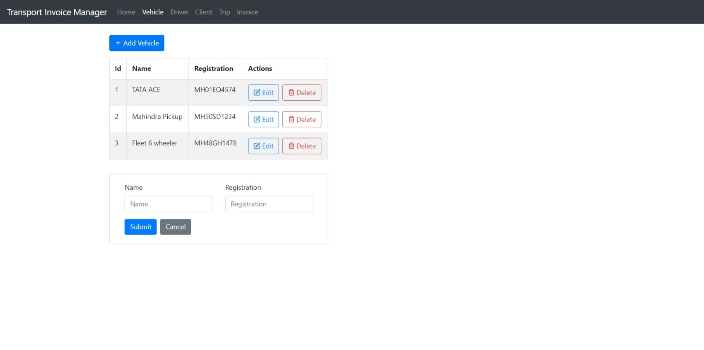
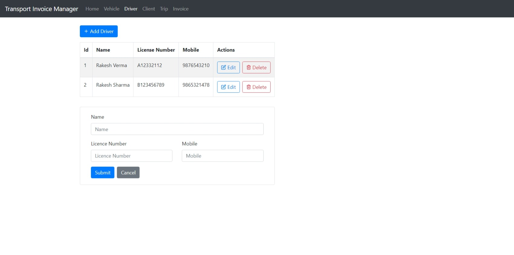
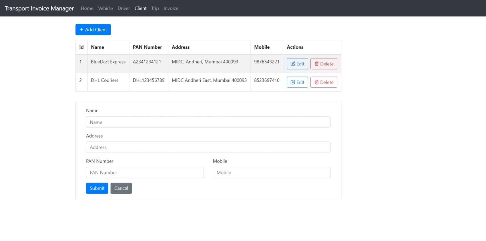
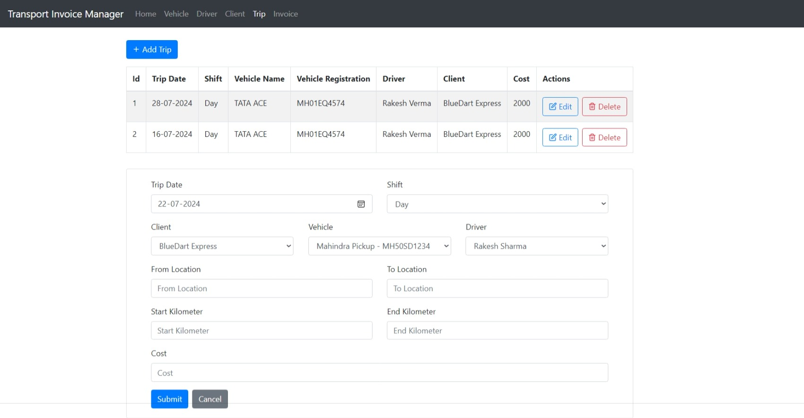
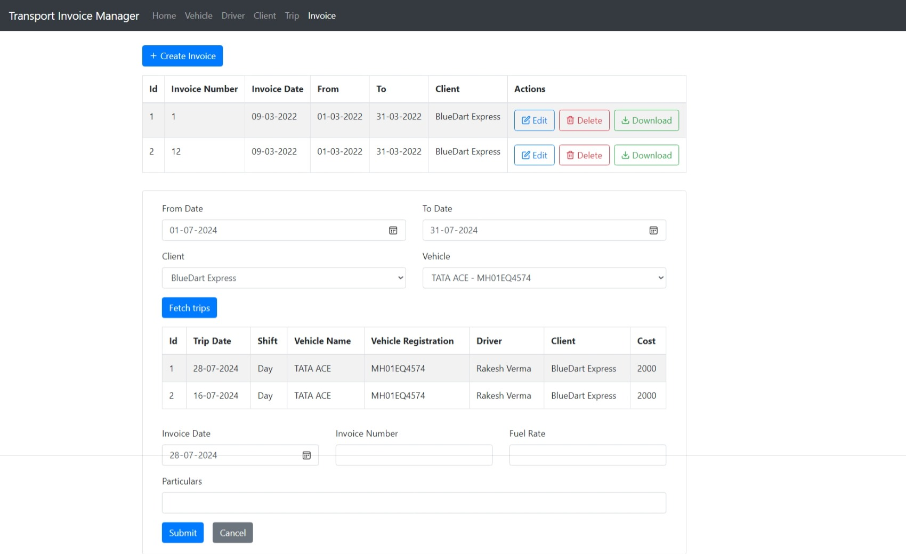

Transport Invoice manager is helping vendors to manage their Vehicle fleet data, drivers, trips and generate trip invoices for their clients.

Please refer screenshots below to get a glimps of the user interface.

1. Manage your Vehicle fleet.

2. Manage your Drivers.

3. Manage your clients.

4. Manage your vehicle trips with client and driver details.

5. Search you trips for given date range, client or vehicle and select Trips to create an invoice.
